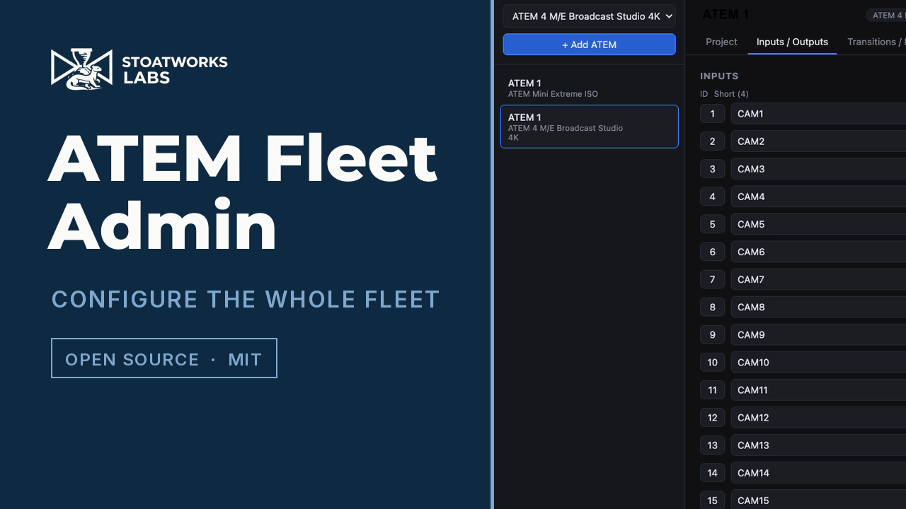
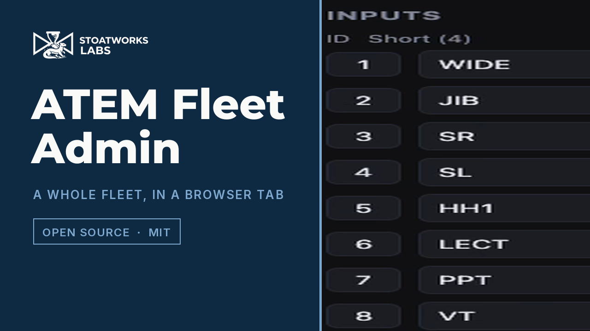

# ATEM Fleet Admin

Provision a **fleet of Blackmagic ATEM switchers at once**. Define any number of
ATEMs in one place, build each device's configuration through model-aware forms
(dropdowns + text fields), then either:

1. **Generate folders** — write a loadable `config.xml` + `Media/` folder per
   device for manual loading into ATEM Software Control, or
2. **Connect & apply** — push the settable subset of the config to a switcher
   over the network via [`atem-connection`](https://www.npmjs.com/package/atem-connection).

Built with electron-vite + React + TypeScript, matching the stack of its sibling
[animATEM](https://github.com/stoatworks-labs/animATEM).

[](https://www.youtube.com/watch?v=r8oRdKLFgGk)

*A 45-second tour of the real app. Two switchers of different models, showing the
form adapt: a Mini Extreme has Streaming and Recording tabs, a 4 M/E Broadcast
Studio has SuperSource instead.*


*The same adaptation as a still: three switchers in the sidebar, two models between
them. The selected 4 M/E exposes a SuperSource tab and twenty inputs with full AUX
routing — the Mini Extremes above it show neither.*


<!-- downloads:start -->

## Download

**[v0.3.0](https://github.com/stoatworks-labs/atem-fleet-admin/releases/tag/v0.3.0)** — prebuilt for macOS, Windows and Linux. Pick your platform:

<details>
<summary><b>macOS</b> — Apple Silicon, Intel</summary>

| Build | Download | Size |
| --- | --- | --- |
| Apple Silicon · .dmg disk image | [`ATEM.Fleet.Admin-0.3.0-arm64.dmg`](https://github.com/stoatworks-labs/atem-fleet-admin/releases/download/v0.3.0/ATEM.Fleet.Admin-0.3.0-arm64.dmg) | 119 MB |
| Intel · .dmg disk image | [`ATEM.Fleet.Admin-0.3.0.dmg`](https://github.com/stoatworks-labs/atem-fleet-admin/releases/download/v0.3.0/ATEM.Fleet.Admin-0.3.0.dmg) | 126 MB |
| Apple Silicon · .pkg installer | [`atem-fleet-admin-0.3.0-macos-arm64.pkg`](https://github.com/stoatworks-labs/atem-fleet-admin/releases/download/v0.3.0/atem-fleet-admin-0.3.0-macos-arm64.pkg) | 119 MB |
| Intel · .pkg installer | [`atem-fleet-admin-0.3.0-macos-x64.pkg`](https://github.com/stoatworks-labs/atem-fleet-admin/releases/download/v0.3.0/atem-fleet-admin-0.3.0-macos-x64.pkg) | 126 MB |
| Apple Silicon · .zip archive | [`ATEM.Fleet.Admin-0.3.0-arm64-mac.zip`](https://github.com/stoatworks-labs/atem-fleet-admin/releases/download/v0.3.0/ATEM.Fleet.Admin-0.3.0-arm64-mac.zip) | 115 MB |
| Intel · .zip archive | [`ATEM.Fleet.Admin-0.3.0-mac.zip`](https://github.com/stoatworks-labs/atem-fleet-admin/releases/download/v0.3.0/ATEM.Fleet.Admin-0.3.0-mac.zip) | 122 MB |

</details>

<details>
<summary><b>Windows</b> — x64 & ARM64, x64, ARM64</summary>

| Build | Download | Size |
| --- | --- | --- |
| x64 & ARM64 · .exe installer | [`atem-fleet-admin-0.3.0-setup.exe`](https://github.com/stoatworks-labs/atem-fleet-admin/releases/download/v0.3.0/atem-fleet-admin-0.3.0-setup.exe) | 220 MB |
| x64 · .exe installer | [`atem-fleet-admin-0.3.0-x64-setup.exe`](https://github.com/stoatworks-labs/atem-fleet-admin/releases/download/v0.3.0/atem-fleet-admin-0.3.0-x64-setup.exe) | 112 MB |
| ARM64 · .exe installer | [`atem-fleet-admin-0.3.0-arm64-setup.exe`](https://github.com/stoatworks-labs/atem-fleet-admin/releases/download/v0.3.0/atem-fleet-admin-0.3.0-arm64-setup.exe) | 108 MB |
| x64 & ARM64 · portable .exe | [`atem-fleet-admin-0.3.0-portable.exe`](https://github.com/stoatworks-labs/atem-fleet-admin/releases/download/v0.3.0/atem-fleet-admin-0.3.0-portable.exe) | 220 MB |
| x64 · portable .exe | [`atem-fleet-admin-0.3.0-x64-portable.exe`](https://github.com/stoatworks-labs/atem-fleet-admin/releases/download/v0.3.0/atem-fleet-admin-0.3.0-x64-portable.exe) | 112 MB |
| ARM64 · portable .exe | [`atem-fleet-admin-0.3.0-arm64-portable.exe`](https://github.com/stoatworks-labs/atem-fleet-admin/releases/download/v0.3.0/atem-fleet-admin-0.3.0-arm64-portable.exe) | 108 MB |
| x64 · .zip archive | [`ATEM.Fleet.Admin-0.3.0-win.zip`](https://github.com/stoatworks-labs/atem-fleet-admin/releases/download/v0.3.0/ATEM.Fleet.Admin-0.3.0-win.zip) | 146 MB |
| ARM64 · .zip archive | [`ATEM.Fleet.Admin-0.3.0-arm64-win.zip`](https://github.com/stoatworks-labs/atem-fleet-admin/releases/download/v0.3.0/ATEM.Fleet.Admin-0.3.0-arm64-win.zip) | 145 MB |

</details>

<details>
<summary><b>Linux</b> — x64, ARM64</summary>

| Build | Download | Size |
| --- | --- | --- |
| x64 · .deb package (Debian/Ubuntu) | [`atem-fleet-admin_0.3.0_amd64.deb`](https://github.com/stoatworks-labs/atem-fleet-admin/releases/download/v0.3.0/atem-fleet-admin_0.3.0_amd64.deb) | 97 MB |
| ARM64 · .deb package (Debian/Ubuntu) | [`atem-fleet-admin_0.3.0_arm64.deb`](https://github.com/stoatworks-labs/atem-fleet-admin/releases/download/v0.3.0/atem-fleet-admin_0.3.0_arm64.deb) | 92 MB |
| x64 · .rpm package (Fedora/RHEL) | [`atem-fleet-admin-0.3.0.x86_64.rpm`](https://github.com/stoatworks-labs/atem-fleet-admin/releases/download/v0.3.0/atem-fleet-admin-0.3.0.x86_64.rpm) | 86 MB |
| ARM64 · .rpm package (Fedora/RHEL) | [`atem-fleet-admin-0.3.0.aarch64.rpm`](https://github.com/stoatworks-labs/atem-fleet-admin/releases/download/v0.3.0/atem-fleet-admin-0.3.0.aarch64.rpm) | 81 MB |
| x64 · AppImage | [`ATEM.Fleet.Admin-0.3.0.AppImage`](https://github.com/stoatworks-labs/atem-fleet-admin/releases/download/v0.3.0/ATEM.Fleet.Admin-0.3.0.AppImage) | 125 MB |
| ARM64 · AppImage | [`ATEM.Fleet.Admin-0.3.0-arm64.AppImage`](https://github.com/stoatworks-labs/atem-fleet-admin/releases/download/v0.3.0/ATEM.Fleet.Admin-0.3.0-arm64.AppImage) | 125 MB |

</details>

All builds, checksums and release notes: [github.com/stoatworks-labs/atem-fleet-admin/releases](https://github.com/stoatworks-labs/atem-fleet-admin/releases).

These builds are unsigned, so macOS and Windows each warn once on first launch — see [Unsigned builds — Gatekeeper, SmartScreen & Defender Firewall](#unsigned-builds--gatekeeper-smartscreen--defender-firewall) for the one-time fix.

<!-- downloads:end -->

## Why

Configuring ATEMs one at a time in ATEM Software Control — input/output names,
SuperSource, media pools, streaming/recording, transitions — is slow and
error-prone across a fleet. Fleet Admin turns it into a single form-driven pass
with a repeatable, versionable project file (`*.afa.json`).

## Model-aware profiles

Each device is assigned a model. The editor shows only the tabs and options that
model supports, and the XML generator only emits the sections it has. Phase 1
ships two profiles spanning the two hardware classes:

| Capability              | ATEM Mini Extreme ISO | ATEM 4 M/E Broadcast Studio 4K |
| ----------------------- | :-------------------: | :----------------------------: |
| Input / output names    |          ✅           |               ✅               |
| Output routing (AUX)    |          ✅           |               ✅               |
| UVC / USB-C output      |          ✅           |               —                |
| Default transition      |          ✅           |               ✅               |
| Fade to black           |          ✅           |               ✅               |
| DVE                     |          ✅           |               ✅               |
| Media pool + players    |          ✅           |               ✅               |
| Streaming               |          ✅           |               —                |
| Recording (bitrate/ISO) |          ✅           |               —                |
| SuperSource             |           —           |               ✅               |
| Multi-M/E               |           —           |           ✅ (4 M/E)           |

Adding a model is a single new entry in [`src/shared/models.ts`](src/shared/models.ts).

## Fields covered

Input/output names · show/project name (recorder filename) · recording bitrate ·
recording mode (program vs ISO) · output sources incl. UVC · SuperSource layout &
sources · media pool items · media player assignments · streaming destination /
key / type / bandwidth · fade-to-black on/off · default transition time & type ·
DVE settings.

## The two output paths

### Generate folders (highest fidelity)

Pick an output directory; Fleet Admin writes:

```
<OutputDir>/<FleetName>/<DeviceName>/config.xml
<OutputDir>/<FleetName>/<DeviceName>/Media/...
```

Drag the `Media/` files into the switcher's media pool, then use ATEM Software
Control's **Load** to apply `config.xml`. The `<Profile>` XML matches the
element/attribute/nesting conventions of real ATEM save files
(see [`xmlGenerator.spec.ts`](src/main/services/xmlGenerator.spec.ts)).

### Connect & apply (live)

Set a network address on the Project tab and click **Connect & apply selected**.
The settable subset (input names, AUX routing, SuperSource boxes, media-player
assignments, transition/FTB rates, streaming service, ISO mode) is applied live.
Settings the Ethernet protocol can't reach — media-pool uploads, UVC routing,
recording bitrate — are reported as **folder-export only** so nothing is applied
silently.

> **Note on Mini streaming/recording XML.** No ATEM Mini save file was available
> as ground truth, so the Mini `<Streaming>`/`<Recording>` XML elements are
> reconstructed from the protocol and should be validated against a real Mini.
> The live **Connect & apply** path is the authoritative route for those fields.

## Three ways to run it

The same tool ships as **three targets** from this one repo, sharing all the
provisioning logic (`src/shared`):

1. **Electron desktop app** — the native app (`npm run dev`), packaged as
   installers on the main release. Uses IPC + native file dialogs.
2. **Web app + av-launcher tray shell** — a local Node server (`src/server`)
   serving the same React UI in the browser, wrapped by the fleet's
   [av-launcher](https://github.com/stoatworks-labs/av-launcher) shell so it lives
   in the menu bar (pick interface + port, Start/Stop, Open). Ships as a
   self-contained desktop app with an embedded Node runtime — see
   [`launcher/`](launcher). This matches how the sibling
   [atem-overseer](https://github.com/stoatworks-labs/atem-overseer) ships. The
   tray app ships for macOS, Windows and Linux (`.deb`/`.rpm`).
3. **Hosted build — no install, no backend.** The same React UI with no server
   behind it at all (`npm run static:build`), publishable as static assets on a
   Cloudflare Worker. Every ATEM profile is generated in your own tab by the same
   `generateDeviceXml` the desktop app runs, and the export arrives as a `.zip`
   of the identical folder tree. **Nothing is uploaded** — your fleet file never
   leaves your machine. Live at
   **[atem-fleet-admin.stoatworks-labs.com](https://atem-fleet-admin.stoatworks-labs.com)**.

[](https://www.youtube.com/watch?v=s6JW94yhUHs)

*A 47-second tour of the hosted build, filmed at that address: a four-switcher
fleet built from scratch, the forms adapting to each model, and a `.zip` of
loadable `config.xml` folders assembled in the tab. The festival and its
addresses are invented; the export is real.*

The React UI is identical across all three; only `window.api` differs (Electron
IPC, HTTP, or nothing — see [`src/web/`](src/web)). Each backend declares what it
can do through `capabilities`, and the UI adapts rather than offering buttons
that cannot work.

### What the hosted build can't do

| | Desktop / tray | Hosted |
|---|---|---|
| Model-aware forms, XML generation | ✅ | ✅ |
| Export the per-device folder tree | ✅ directories | ✅ `.zip` download |
| Open / save a fleet project | ✅ | ✅ |
| Copy media-pool files into the export | ✅ | ❌ `MEDIA.txt` manifest instead |
| **Connect & apply** over the network | ✅ | ❌ |
| Diagnostics bundle | ✅ | ❌ |

The two exclusions are the same limitation: a web page cannot open a TCP socket
to a switcher on your LAN, and cannot read a file from a path you typed. Media
pool items still generate correctly in the XML — only the source files aren't
gathered, so each device folder carries a `MEDIA.txt` naming what to load into
which slot. **Use the desktop app for live apply.**

## Documentation

| Doc | Contents |
|---|---|
| [docs/USER-GUIDE.md](docs/USER-GUIDE.md) | Provisioning a fleet: both output paths, what to check, troubleshooting |
| [docs/API.md](docs/API.md) | HTTP + IPC surfaces, the model catalog, the full apply-step table, export layout |
| [docs/DEVELOPING.md](docs/DEVELOPING.md) | Two run targets, three tsconfigs, and the catalog invariant |

## Develop

```bash
npm install

# Electron target
npm run dev          # launch the Electron app
npm run build        # electron-vite production build

# Web target
npm run server:dev   # run the web server (tsx watch) on :4720
npm run preview:web  # vite dev server for the web UI on :5199 (proxies /api → :4720)
npm run web          # build web + server, then serve at http://localhost:4720

# Hosted target (no backend)
npm run preview:static  # vite dev server for the backend-less UI on :5200
npm run static:build    # production build into out-static/
npm run deploy:static   # build, then publish the Worker (needs Cloudflare creds)

# Shared
npm test             # vitest unit tests (XML generator, exporter, network apply)
npm run typecheck    # node (electron) + web + server
```

Electron installers: `npm run build:mac` / `build:win` / `build:linux`
(win/mac/linux × x64/arm64 via electron-builder). The av-launcher desktop app is
built by `.github/workflows/release-desktop.yml` (see [`launcher/README.md`](launcher/README.md)).

## Architecture

- [`src/shared/`](src/shared) — `models.ts` (capability profiles), `config.ts`
  (the single source-of-truth data model), `protocol.ts` (IPC types + backend
  capabilities), `xmlGenerator.ts` and `names.ts`. Everything here is pure and
  runs unchanged in Electron, in Node and in a browser tab.
- [`src/main/services/`](src/main/services) — `folderExporter.ts`,
  `fleetStore.ts`, `networkApply.ts`: the parts that need a filesystem or a
  socket.
- [`src/web/`](src/web) — the two browser backends (`webApi.ts` over HTTP,
  `staticApi.ts` over nothing) and the in-browser archive builder.
- [`src/renderer/src/`](src/renderer/src) — React UI: fleet sidebar +
  capability-gated tabbed device editor + export bar.

## Disclaimer

This project was developed with AI assistance (Claude). It is not affiliated
with or endorsed by Blackmagic Design. "ATEM" is a trademark of Blackmagic
Design. Generated configurations — especially the reconstructed Mini
streaming/recording XML — should be verified on your own hardware before use in
production.

## Unsigned builds — Gatekeeper, SmartScreen & Defender Firewall

The release binaries are **not code-signed or notarized** — that needs paid Apple
and Microsoft developer certificates this project doesn't carry. The downloads are
fine; the OS just can't identify the publisher, so it warns you the first time.

- **macOS** — *"cannot be opened because the developer cannot be verified"*.
  Right-click the app → **Open** → **Open**, or clear the flag:
  `xattr -dr com.apple.quarantine "/Applications/ATEM Fleet Admin.app"`
- **Windows** — SmartScreen shows *"Windows protected your PC"* →
  **More info** → **Run anyway**.
- **Windows Defender Firewall** — first launch pops *"Allow ATEM Fleet Admin to
  communicate on these networks"*. Tick **Private** (and **Domain** on a managed
  network) — ATEM Fleet Admin needs it to serve the web UI and push configuration to
  ATEMs over the network. Deny it and "Connect & apply" will fail — the folder-export
  path still works offline.
- **Linux** — no signing gate.

Per-artifact steps, self-signing, checksum verification and the Defender Firewall reset
procedure: **[docs/UNSIGNED.md](docs/UNSIGNED.md)**.

## License

MIT
