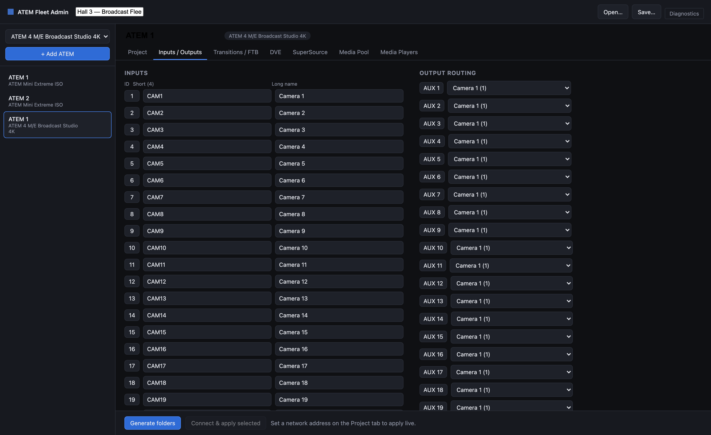

# ATEM Fleet Admin user guide

ATEM Fleet Admin **provisions a whole rig of Blackmagic ATEM switchers from one place**. You
describe each switcher once in model-aware forms, then either export a loadable config folder per
device or push the settable part straight down the network.

> **Before you rely on this:** "Connect & apply" writes to real switchers immediately, with no
> confirmation and no undo — on an already-configured rig, it overwrites. Live apply also
> **cannot set everything**; three settings always remain unset afterwards, by protocol
> limitation. And the ATEM Mini's streaming/recording XML is **reconstructed rather than
> verified**, because no Mini save file was available as ground truth.
>
> This project was written with AI assistance and reviewed by a human. Review it before relying
> on it on a live install.

---

## Pick your run target

The same tool ships two ways, sharing all the provisioning logic:

- **Electron desktop app** — native file dialogs; macOS, Windows and Linux.
- **Web app + av-launcher tray shell** — a local Node server serving the same UI in a browser,
  wrapped in a menu-bar app.

The UI is identical. **One behaviour differs, and it matters:**

| | Electron | Web / tray |
|---|---|---|
| Open / save a fleet | native file dialog | browser download / upload |
| Generate folders | **you pick the directory** | **writes to the server's configured export directory, no picker** |

In the web target, "Generate folders" writes files **on the machine running the server**, not the
machine running the browser. The health endpoint reports where, and the UI shows it — but if you
are driving it remotely, the folders are not on your laptop.

---

## Building a fleet

Add a switcher, pick its model, and fill in the forms. The forms are **model-aware**: you only see
the tabs and options that model actually has, so an ATEM Mini Extreme doesn't offer SuperSource
and a 4 M/E doesn't offer streaming.



*Note the **Short (4)** column — the switcher's own limit, and the reason long names get
truncated.*

What the forms cover: input/output names · show/project name (the recorder filename) · recording
bitrate · recording mode (program vs ISO) · output sources including UVC · SuperSource layout and
sources · media pool items · media player assignments · streaming destination, key, type and
bandwidth · fade-to-black · default transition time and type · DVE settings.

**Two models ship**: ATEM Mini Extreme ISO and ATEM 4 M/E Broadcast Studio 4K. They span the two
hardware classes; other models need a catalog entry — see [DEVELOPING.md](DEVELOPING.md).

---

## Path A — Generate folders

The higher-fidelity route. It writes a loadable config per device:

```
<OutputDir>/<FleetName>/<DeviceName>/config.xml
<OutputDir>/<FleetName>/<DeviceName>/Media/...
```

Drag the `Media/` files into the switcher's media pool, then use ATEM Software Control's **Load**
to apply `config.xml`.

### Check `mediaMissing` on every export

If a media item has no file path, or its file can't be copied, **the export does not fail**. The
item is listed under "media missing" for that device and everything else continues.

So a device that reports success can still have an **empty `Media/` folder**. That is exactly what
a mistyped or moved source path looks like. Check the missing list before you leave site.

### Device names that sanitise alike will collide

Folder names have `< > : " / \ | ? *` and whitespace replaced with `_`, and trailing dots
stripped. **`Studio 1` and `Studio/1` both become `Studio_1`, and the second overwrites the
first.** There is no uniquing and no warning. Name devices distinctly.

### The Mini's streaming/recording XML is unverified

No ATEM Mini save file was available as ground truth, so the Mini's `<Streaming>` and
`<Recording>` XML elements are **reconstructed from the protocol**, and should be validated
against a real Mini before you rely on them.

**For those two fields specifically, live apply is the authoritative route**, not the XML. The
big-switcher XML *is* validated against a real autosave file.

---

## Path B — Connect & apply

Set a network address on the Project tab and click **Connect & apply selected**. It connects and
applies the settable subset, reporting a status per setting group.

| Applied live | Reported as folder-export only |
|---|---|
| Input names | **UVC / USB-C output routing** |
| Output routing (AUX) | **Recording bitrate / quality** |
| SuperSource boxes | **Media pool items** |
| Media player assignments | |
| Default transition rate | |
| Fade to black rate | |
| Streaming service | |
| Recording ISO mode | |

> **After a completely successful live apply, three things are still not set on the switcher:**
> the USB webcam routing, the recording quality, and the media pool contents. The Ethernet
> protocol cannot reach them.
>
> The result marks those steps **skipped, not failed** — deliberately, so nothing is applied
> silently and nothing is falsely reported as done. **Skipped is not an error. It is a to-do.**
> Use the folder export for those three.

Other behaviours worth knowing:

- **Input short names are truncated to 4 characters**, silently — that is the switcher's limit.
- **The transition rate and fade-to-black rate are applied to every M/E** on the model, not just
  M/E 1.
- **A connection failure appears as a single "Connect" step in error**, not as a crash — so a
  device that was never reached looks like a normal result with one bad row. Check `connected`.

---

## A sensible order of operations

1. Build the fleet and save the project file.
2. **Generate folders first**, and check every device's `mediaMissing` list.
3. Load `config.xml` on each switcher via ATEM Software Control, and drag the media in.
4. Use **Connect & apply** for the settable subset when you want to push a change without walking
   round the rig — remembering it can't do the three skipped groups.
5. Keep the fleet project file. It is the only record of what you intended.

---

## The web target has no authentication

Defaults are `localhost:4720`, which is safe. But the host is configurable
(`ATEM_FLEET_ADMIN_HOST`), and **binding anything other than localhost exposes, with no
password**:

- an endpoint that **reconfigures real switchers on your network**, and
- an endpoint that **writes files onto the host's filesystem**.

There is no token, no login and no TLS. Leave it on localhost.

---

## Troubleshooting

| Symptom | Cause |
|---|---|
| **Export succeeded but `Media/` is empty** | Source files missing or unreadable — check the media-missing list; it is not an error. |
| **A device's folder is missing or has the wrong contents** | Two device names sanitised to the same folder name and one overwrote the other. |
| **Live apply reported "skipped" rows** | Expected. Those settings can't be reached over Ethernet — use the folder export. |
| **Applied everything, USB output still wrong** | UVC routing is folder-export only. |
| **Applied everything, recording quality unchanged** | Recording bitrate is folder-export only. |
| **Input names came out truncated** | Short names are cut to 4 characters — a switcher limit. |
| **`config.xml` won't load into ATEM Software Control** | Usually a model mismatch — the `product` string has to match exactly. For a Mini's streaming/recording sections, note they are unverified. |
| **Everything reported error** | Check `connected` — a failed connection shows as a single Connect step in error. |
| **"unknown ATEM model"** | The model isn't in the catalog. Two ship; others need adding. |
| **Generated folders aren't where I expected (web target)** | They are on the server's machine, under its export directory. |
| **Tray app's helpers die silently on macOS** | Only on a self-built or pre-notarisation copy — the releases are signed and notarised. Approving an unsigned `.app` does not unquarantine its bundled binaries. See [`launcher/SIGNING.md`](../launcher/SIGNING.md). |

---

## See also

- [API.md](API.md) — HTTP/IPC surfaces, the model catalog, the full apply-step table
- [DEVELOPING.md](DEVELOPING.md) — the run targets, the three tsconfigs, the catalog invariant
- [README](../README.md) — what it does, field coverage, the two output paths
